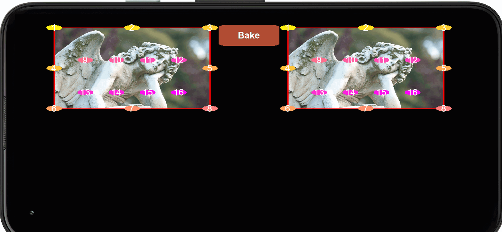

A little test (and some stray code) involving thin plate splines and images.

This began life long ago, as an adaptation of the code in the final chapter of _ShaderX7_.

Per the book's title, that example tailors the technique toward use in a shader. This does as well, although it's a bit stripped down from that.

The technique takes two sets of "landmarks", in this case superimposed on a pair of images. Interpolation will move each landmark from one position to its
partner exactly, while everything else will have minimized error / "bending".

---

In the book, the affine terms were interpolated with _t_. I often consulted the [WarpTPS](https://github.com/dg1an3/WarpTPS) repository, and there it was
done with the remaining terms instead. Strangely, I only got plausible results using both. I've probably overlooked something, but by that time was getting
definite tunnel vision...

---

Some of the code is cobbled from my other repositories.

---

The first GIF shows a few boundary landmarks being manipulated, while the second one adjusts a pair of points, one on each image, that corresponding to one another.

It should be possible to create a visual morph between two images (**WarpTPS** has an example of this) by stacking them, then using the the interpolation times (`t` and `1 - t` respectively) to alpha-
blend their current results.

---

The example shown in the GIF is cramming all the information into uniform data. This puts a hard limit on the number of points, although I didn't quite use them all: currently Solar2D caps them to 16,
which is the minimum guaranteed by `gl_MaxFragmentUniformVectors` on OpenGL ES 2.0. There's a variant in the code that instead crams part of that--one set of landmark positions--into a ("nearest"-filtered)
texture, letting us eke out a few more. (There is also a `Bytemap` variant that was used to do some initial tests, but it's NOT shader-based and slow as molasses.)

The _ShaderX7_ example basically gets unlimited inputs due to being a multi-pass effect. This is what I was trying, long ago, but it was hit-or-miss... you would be storing the intermediate morph
contributions in a texture, and it would often exceed the precision available. The recommendation from the book was to use floating point textures, which aren't currently implemented in Solar2D.
The examples here instead gather all contributions in one go.

---

In addition to the uniform / texture variant, I also tried normalized vs. texture dimensions as far as computing all the inter-landmark distances. (I didn't make this a full 2x2 matrix of possibilities,
but rather just randomly paired them with the other two.) The majority of the scale factors cancel out, but there are the `log()` operations to consider. From what I can tell, though, the normalized
version held up quite well, so seems reasonable to use due to some simplifications it allows. The texture dimension version is written a big strangely, including precalculating some larger numbers
into the affine terms and such, because I wasn't sure some calculations would stay within `mediump` or at least not get choppy.

---

The `old` folder contains a few messy remnants of my long-ago attempts at this, including building up a big multi-pass shader. This would _sometimes_ work beautifully, but often not, and as mentioned
above I imagine a big part of this was the poor little RBGA8 texture crying uncle.

The sample was another try using an [Eigen plugin](https://github.com/ggcrunchy/eigen-lua). I seem to remember this working quite well, though said plugin wanted (and still does!) quite a lot of rework
--and updates now, I suppose--so I never went too far with it.